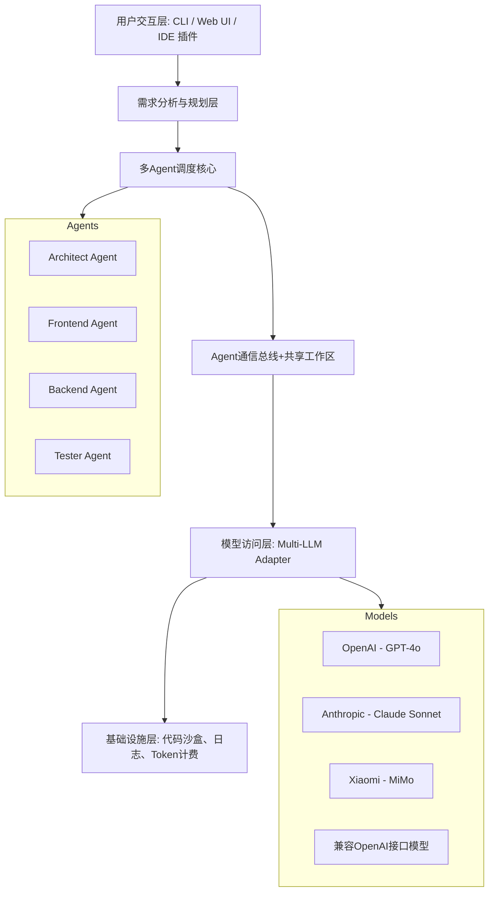

# DevFlow (AgentOrchestra) 项目架构设计文档

## 1. 项目定位
DevFlow 是一个多 Agent 协作式全栈开发平台。它能将一个复杂开发需求自动拆解为多个子任务，分配给多个具备不同职能的 AI Agent（架构师、前端、后端、测试等）并行/串行执行，Agent 之间通过结构化消息协议协同，最终输出完整的可运行项目。

## 2. 技术栈及依赖
- **运行环境**：Python 3.11+, Node.js 18+（仅前端 UI 时选用）
- **Agent 核心框架**：可基于 LangGraph / CrewAI / AutoGen，或自研轻量调度器
- **LLM 统一网关**：自研 Multi-LLM Adapter 层，统一封装各模型 API
- **前端 UI（可选）**：React + Vite + TailwindCSS
- **任务编排**：DAG 有向无环图描述任务依赖关系
- **持久化**：本地 SQLite（开发阶段）/ PostgreSQL，存储 Agent 状态和项目历史
- **通信协议**：基于 JSON Schema 的结构化消息，Agent 间通过共享工作区交换数据

## 3. 系统总体架构



## 4. 核心模块详设
### 4.1模型访问层（Multi-LLM Adapter）
**职责**：屏蔽不同 AI 提供商的 API 差异，提供统一接口，支持动态配置模型。
- 抽象基类 BaseLLM：
    - chat(messages, tools=None) → ChatResponse
    - stream_chat(messages, tools=None) → Iterator[Delta]
- 具体实现类：
    - OpenAIModel：支持 GPT-4o、GPT-4-turbo，支持 function calling
    - ClaudeModel：支持 Claude 3.5 Sonnet / Opus，适配 tools 格式
    - MiMoModel：适配 Xiaomi MiMo Orbit API，兼容 OpenAI 风格
    - OpenAICompatibleModel：适配任何 OpenAI 兼容接口（如 Ollama、DeepSeek）

- 配置方式：通过 config.yaml 或环境变量加载模型列表，每个模型可指定：
    - provider: openai/anthropic/mimo/openai_compatible
    - model_name: gpt-4o / claude-sonnet-4-20250514 / mimo-v2.5-pro
    - api_key: 从环境变量注入，不硬编码
    - base_url: 支持自定义 endpoint（如 MiMo 的专属地址）
    - params: 温度、最大 token 数等默认参数
### 4.2 Agent 定义与角色管理
每个 Agent 拥有系统提示词（System Prompt）、工具列表（Function Tools）、指定使用的模型（可从配置中选择，如 Architect 用 MiMo-Pro，Frontend 用 Claude）。
- Agent 配置结构（config/agents.yaml）：
```yaml
agents:
  architect:
    model: mimo-v2.5-pro
    system_prompt: "你是系统架构师，负责将需求拆解为模块..."
    tools: [search_docs, design_db_schema]
    max_iterations: 10
  frontend:
    model: gpt-4o
    system_prompt: "你是前端专家，使用 React + Tailwind 生成代码..."
    tools: [write_file, read_file, run_tests]
  backend:
    model: claude-sonnet-4-20250514
    system_prompt: "你是后端工程师，使用 FastAPI..."
    tools: [write_file, read_file, execute_sql]
  tester:
    model: mimo-v2.5
    system_prompt: "生成单元测试和集成测试..."
    tools: [write_file, run_tests]
```
### 4.3 任务规划与 DAG 生成
- 用户输入自然语言需求后，由 Planning Module（使用配置的默认模型）分析需求，生成结构化 JSON 任务图：
```json
{
  "project_name": "auth-blog",
  "tasks": [
    {"id": "1", "type": "design", "agent": "architect", "depends": []},
    {"id": "2", "type": "backend", "agent": "backend", "depends": ["1"]},
    {"id": "3", "type": "frontend", "agent": "frontend", "depends": ["1"]},
    {"id": "4", "type": "test", "agent": "tester", "depends": ["2","3"]}
  ]
}
```
### 4.4 Agent 间通信与共享工作区
- **共享工作区**：一个虚拟文件系统，Agent 通过工具读写项目文件。
- **消息通知**：任务完成后，调度器检查后续任务依赖，向后续 Agent 提供前序 Agent 的输出摘要（如 API 接口定义、数据库 Schema）。
- **冲突解决**：如前后端并行开发时对接口定义不一致，由 Architect Agent 自动介入裁定。
### 4.5 执行引擎
- 采用异步并发执行（asyncio），可根据 DAG 并行度同时运行多个无依赖任务。
- 每个 Agent 运行为一个独立会话，循环执行 Thought-Action-Observation，直至完成任务或达到最大迭代次数。
- 执行过程全程记录日志，展示每个 Agent 的思考链（CoT）和工具调用详情。
### 4.6 可观测性与 Token 管理
- 统计每次会话的 Token 消耗（按模型、按 Agent 分类）。
- 展示预估总消耗，便于用户在不同模型间权衡成本。
- 支持设置单次任务总 Token 上限，防止意外超额。
